<h1 align="center">Webdesign @cmda-minor-web 1819</h1>

<p align="center"><b>A soundless podcast created for <a href="https://www.linkedin.com/in/marie-van-driessche/?originalSubdomain=nl">Marie van Driessche</a>. Marie is born without the ability to hear; podcasts are audio-based, this is the solution.</b>
</p>

<br>

<p align="center">
  <a href="https://podcast.webgaan.nl/">
    
  </a>
  &nbsp;&nbsp;&nbsp;
  <a href="https://github.com/Mennauu/browser-technologies-1819/blob/master/LICENSE">
    
  </a>
</p> 

<br>

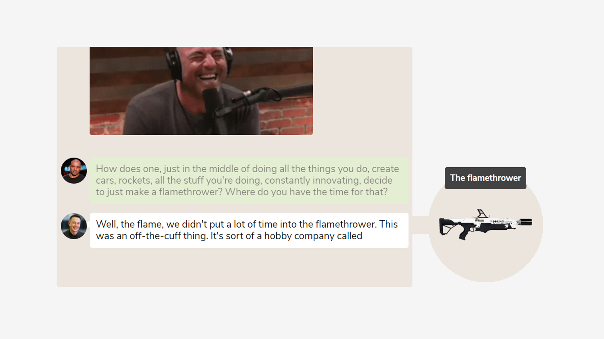

<br>

<!-- ☝️ replace this description with a description of your own work -->
## Introduction
This soundless podcast is made as part of a course from [@cmda-minor-web 18-19](https://github.com/cmda-minor-web/browser-technologies-1819). In this course I had to create a podcast (in the form of a website) with the aim that Marie can enjoy a podcast as much (or even more) as someone who listens to the podcast.

Some resources possess an emoticon to help you understand which type of content you may find:

- 📖: Documentation or article
- 🛠: Tool or library
- 📹: Video

<!-- Maybe a table of contents here? 📚 -->
## Table of Contents

- [Installation](#installation)
- [Research](#research)
  - [Webdesign](#webdesign)
- [Concepting and meetings with Marie](#concepting-and-meetings-with-marie)
  - [First meeting](#first-meeting)
    - [Concept](#concept)
  - [Second meeting](#second-meeting)
    - [Concept](#concept)
  - [Third meeting](#third-meeting)
    - [Concept](#concept)
- [Soundless podcast](#soundless-podcast)
- [Exclusive Design Principles](#exclusive-design-principles)
  - [Study situation](#study-situation)
  - [Ignore conventions](#ignore-conventions)
  - [Prioritise identity](#prioritise-identity)
  - [Add nonsense](#add-nonsense)
- [Wishlist](#withlist)
- [Sources](#sources)
- [License](#license)

<!-- How about a section that describes how to install this project? 🤓 -->
## Installation
1. Open your terminal
2. Change the directory to a folder in which you want to place the files
```bash
cd /~path
```
3. Clone the repository (you're going to need [Git](https://www.linode.com/docs/development/version-control/how-to-install-git-on-linux-mac-and-windows/))
```bash
git clone https://github.com/Mennauu/web-design-1819
```
4. Change directory to repository
```bash
cd web-design-1819
```
5. Install dependencies from [package.json](https://github.com/Mennauu/web-design-1819/blob/master/package.json)
```bash
npm install
```
6. Run application with [Node](https://nodejs.org/en/)
```bash
npm run dev
```

## Research
The goal was to learn a little bit about website design/accessibility for the Deaf (and hearing impaired) before meeting with Marie.

<details>
  <summary>Read about my research</summary>

### Webdesign

With webdesign we have to consider how someone would move through life without the ability to hear. With this in mind I looked at some helpful tips to create a deaf-friendly website.

1. **Written language**

Deaf individuals use sign-language which is completely different than a standard written language. Reading skills in the hearing impaired community vary and need to be considered.

2. **Visual**

For deaf individuals, the visual experience is heightened. Graphic indicators to show purpose and other visual aids can support their understanding of the material.

3. **Transcripts and closed-captions**

Many websites and marketing platforms use audio and video presentations to connect and share their message. Including text-based transcripts with audio supplements and closed-captioning with videos offers engagement for the deaf.

4. **Contact**

Don't make telephone the only way to get in contact

___

> * 📖 [Friendly Website Design for the Dead and Hering Impaired](http://www.deaftexas.org/friendly-website-design-for-the-deaf-and-hearing-impaired/)
> * 📖 [5 ways to make websites more accessible for deaf people](https://www.hearinglikeme.com/5-ways-to-make-websites-more-accessible-for-deaf-people/)
> * 📖 [Accessible Design for the Deaf](https://www.joedolson.com/2006/03/accessible-design-for-the-deaf/)
> * 📖 [W3: Accessibility](https://www.w3.org/standards/webdesign/accessibility)
> * 📖 [Tips To Make Your Website User-Friendly For People With Disabilities](https://digitalsynopsis.com/design/web-designing-for-accessibility/)

</details>

## User scenario
Joshua is at home, sitting on the couch with his laptop on his knees. He's scrolling through the _"just came in"_ section from news website nu.nl, when all of sudden he sees an article that was published just 2 hours ago. It's about his role model, Elon Musk, being on a podcast from Joe Rogan the other day. He's really excited about this. In Google he searches for a transcript of the audio-based podcast, because Joshua is born without the ability to hear. He finds a couple of transcripts, but they are all automatically generated. There are no punctuation marks which makes it impossible for Joshua to read. Not only that, he also misses out on emotions; he doesn't know if they are being serious or laughing at certain times.

## Concepting and meetings with Marie
I had 3 meetings with Marie. She always came with a talk/translator, which made it possible for us to have a normal conversation. Before the first meeting I drew some ideas I had in mind - the end product is nothing like it.

<details>
  <summary>Check out my first concept drawings</summary>

  <br>

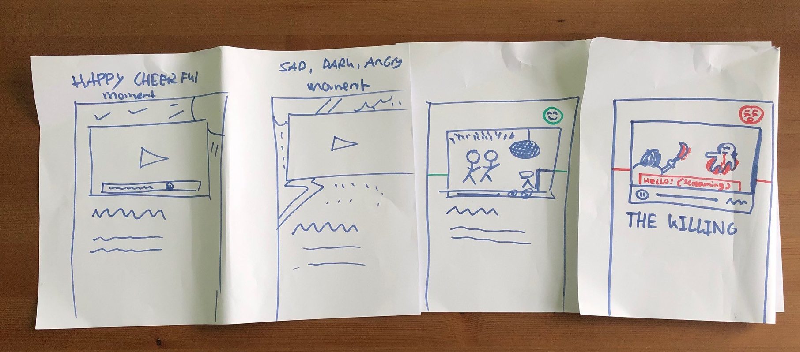

</details>


### First meeting
This was the introduction meeting. I had never before talked to a Deaf person, so I was definitely curious. I was AMAZED by the talk/translator. I could clearly see that what Marie was trying to "say", the talk actually said. For me it wasn't different than any other normal conversation, it felt natural.

During this introduction I learned that noise is abstract for Marie. She doesn't know how noise sounds. As an example she ticked her finger on the table and said, you can hear that, I can only feel it. The harder you tick your finger on the table, the harder the sound, but this isn't the case for Marie. Things like ticking your finger harder doesn't add extra value for Marie.

Something else she said that got my attention was that some text is emphasized or bold, and that we convert that to a different tone in our head. She doesn't. It's only visually different for her (ex. more noticable). After the meeting I read someone saying that for deaf people ["tone" of sign language is communicated through the face. So, if they're grinning while they sign something it's different than if they're rolling their eyes while signing it](https://www.reddit.com/r/NoStupidQuestions/comments/8ixr1b/can_deaf_people_understand_emphasis_in_sign/).

It was nice to meet Marie. She's a very kind and open person.

#### Concept
During the meeting I also figured that podcasts don't always come with video. They usually are audio only. I decided to throw away the concept of video all together. After the meeting I sat down and started thinking for a good 10 minutes about the conversion of a podcast transcript and then it just hit me.. What about a "chat-like" environment, where you also add emotions as a message - but a little different. I drew a quick sketch and made version 1 of the product.

<details>
  <summary>Check out the fast sketch</summary>
  
  <br>

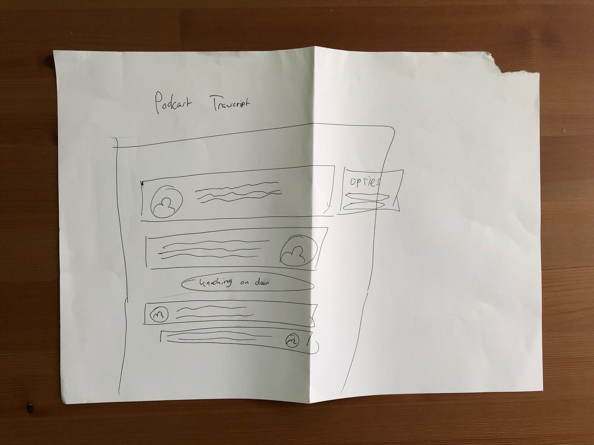

</details>

  <br>

**Version 1**

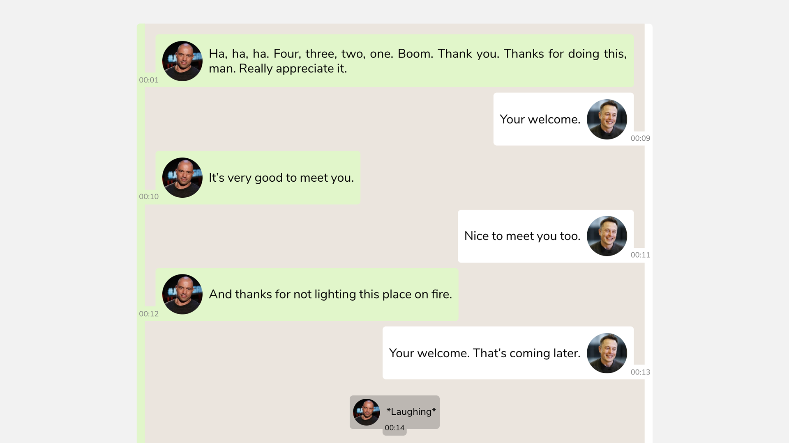

I decided to do some quick testing of this version by showing it to students. They said the padding is to much and the timestamps are weirdly placed. I decided to make some design changes and show version 2 to Marie.

**Version 2**

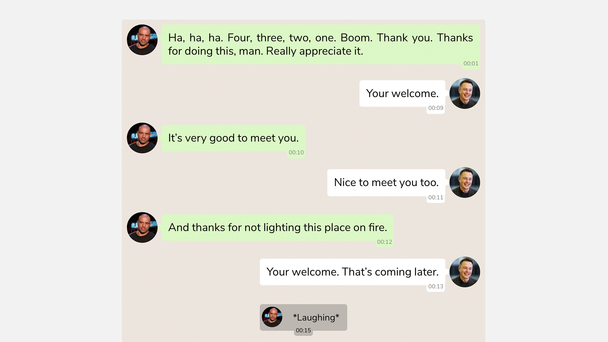

### Second meeting
The second meeting was short. I told her what I created and then showed it to her. During this time I was carefully looking at her facial expressions, because they say a lot. I could tell she liked it, but there was no WOW! I thought: "this is fine, the core is there. The next time I'll try to get the wow-factor".

Underneath are some of the points that she said mentioned during the conversation.

* She didn't like, that the text from the second speaker would be going from right to left.
* She thought the timestamp was the amount of time it would take for the person to say it.
* She wasn't impressed with the emotions, or the amount of it. But she liked the addition.
* She was confused there were 2 bubbles from the same speaker right after eachother

#### Concept
After the second meeting I clearly wanted to spice things up. Tech-wise the product was fine, but now I have to make it more fun for Marie. I implemented all of Marie's feedback and some more.

* Timestamp is only visible when the concering message is hovered
* Both speakers are on the left side
* No more 2 bubbles from the same person in a row
* The written emotions are completely removed and replaced with GIFS, which makes it way more fun.
* Products are added as an extra, which makes the entire conversation way more pleasurable.
* Height of the box is set on a max-height

**Version 3**

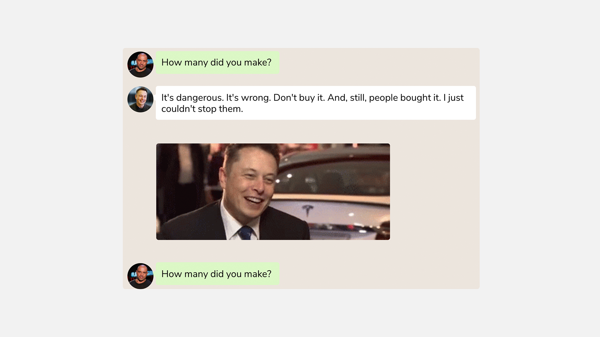


### Third meeting
This meeting I asked her to watch the entire podcast (the example is about 2 minutes long) and afterwards we could discuss it. I hold my hands tight and hoped that she loved it. 

The first few messages were a little to fast for her, she said later on it was completely fine. When she saw the first GIF (which was of Joe Rogan laughing) she put on the biggest smile I had seen of her so far. She loved it! The same thing applied when she saw the addition of the product. A funny thing that I noticed was that she was nodding a lot of the time, she was agreeing with what was being said in the podcast.

After the podcast was done she asked me why there was no space between the messages. Sadly this was a bug, I fixed it right away and she went over the podcast herself again. She pointed at the gifs and gave me double thumbs up and an even a bigger smile - WOW factor accomplished.

Underneath are some of the points that she said mentioned during the conversation.

* She didn't know the names of the speakers (currently only shown on hover)
* Sentences should be placed word by word instead of letter by letter
* The beginning was a little bit to fast, but she got used to it.

I made some crazy notes from this meeting.

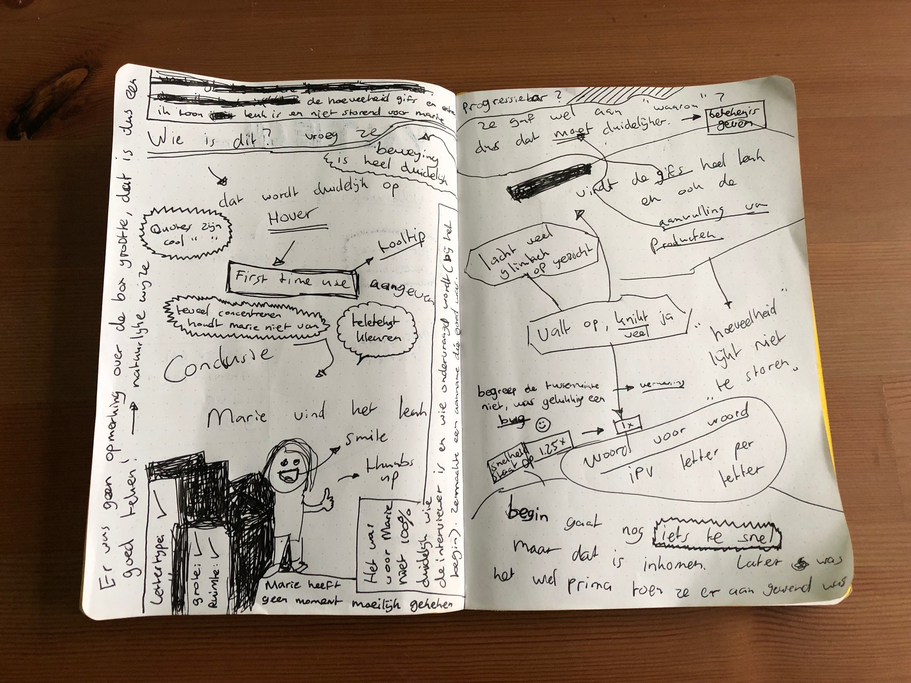

#### Concept

Improvements:

* Sentences are placed word by word (instead of letter by letter)
* Opacity is applied to older sentences - the brightness is halved.
* A start button is added
* Names of the host and guests are added (on the start screen)
* The beginning is a little slower than the rest (unnoticable)

Check the end-results in the next chapter!

## Soundless podcast

## Joe Rogan Experience #1169 - Elon Musk

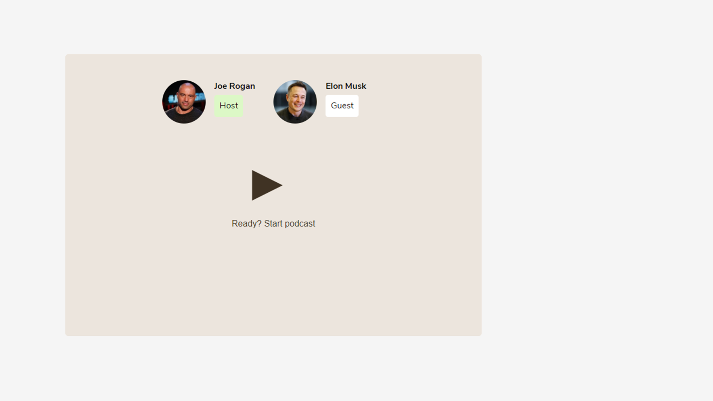


<!--
## Exclusive Design Principles

### Study situation

Deaf individuals:

* Are used to sign-language (and for some also the written language), not spoken.
* The visual experience is heightened.
* Transcripts and closed-captioning offers engagement.

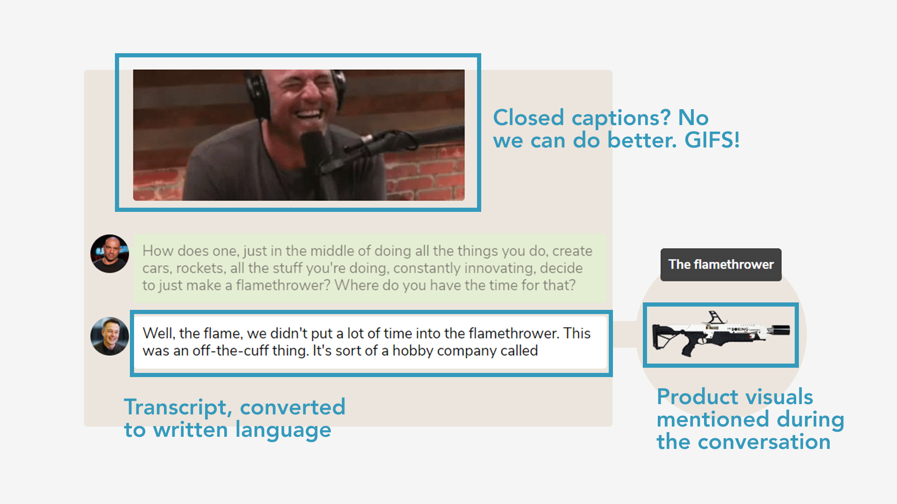

### Ignore conventions

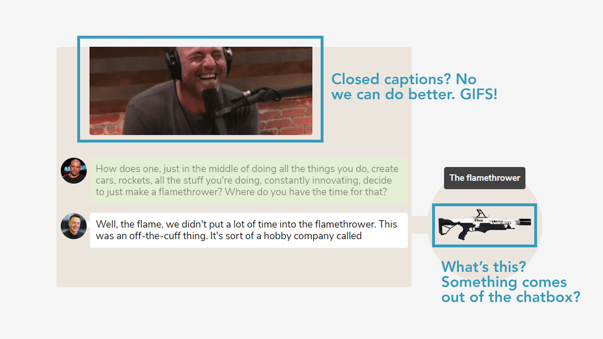

### Prioritise identity

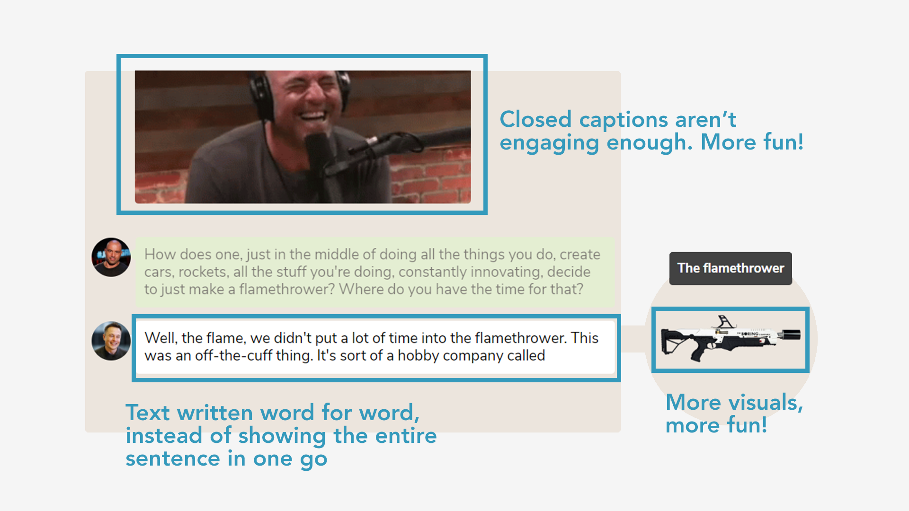

### Add nonense

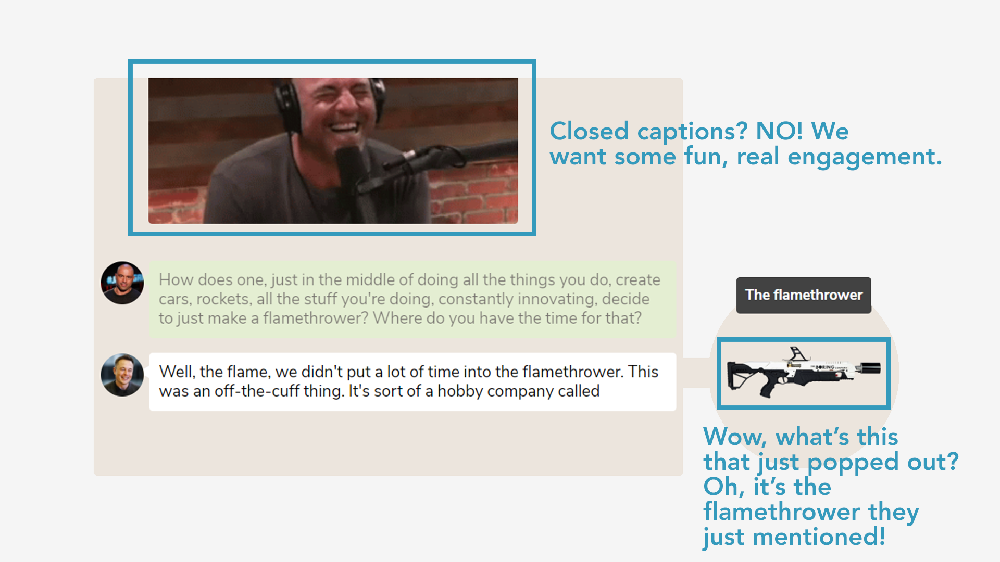
-->

<!-- Maybe a checklist of done stuff and stuff still on your wishlist? ✅ -->
## Wishlist
- [ ] Add technical options: progressbar, pause on hover, adjust (text) speed, continue from given timestamp, show all messages
- [ ] Research which style theme would be the best for this type of podcast, and implement it
- [ ] One last meeting with Marie 😄

<!-- Maybe I used some awesome sources that I can mention 🤔-->
## Sources
Underneath you will find all the sources that were previously mentioned throughout the document and some others which were helpful.

> * 🛠 [Contrast Ratio](https://contrast-ratio.com/#%23cf4436-on-white)
> * 🛠 [Can I use](https://caniuse.com/)

> * 📖 [Friendly Website Design for the Dead and Hering Impaired](http://www.deaftexas.org/friendly-website-design-for-the-deaf-and-hearing-impaired/)
> * 📖 [5 ways to make websites more accessible for deaf people](https://www.hearinglikeme.com/5-ways-to-make-websites-more-accessible-for-deaf-people/)
> * 📖 [Accessible Design for the Deaf](https://www.joedolson.com/2006/03/accessible-design-for-the-deaf/)
> * 📖 [W3: Accessibility](https://www.w3.org/standards/webdesign/accessibility)
> * 📖 [Tips To Make Your Website User-Friendly For People With Disabilities](https://digitalsynopsis.com/design/web-designing-for-accessibility/)

<!-- How about a license here? 📜 (or is it a licence?) 🤷 -->
## License 
See the [LICENSE file](https://github.com/Mennauu/browser-technologies-1819/blob/master/LICENSE) for license rights and limitations (MIT).

